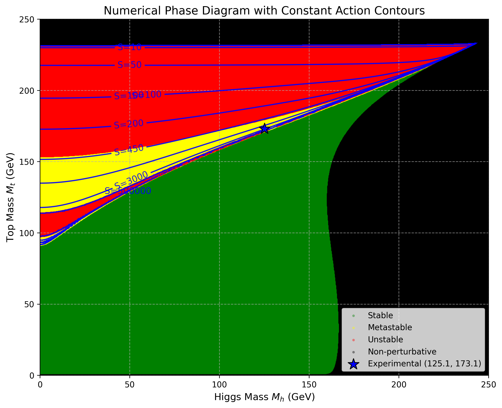
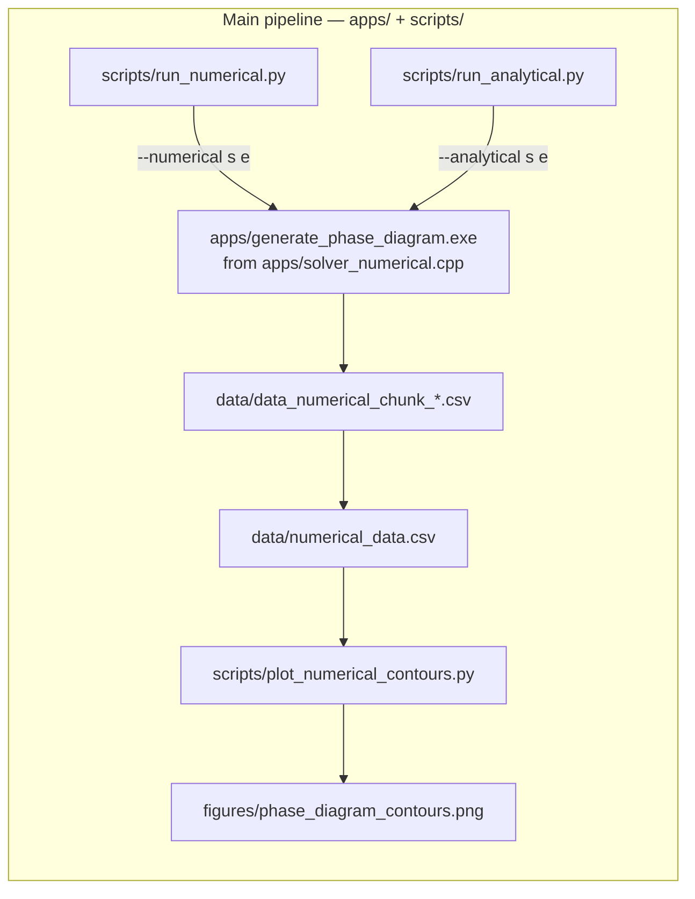
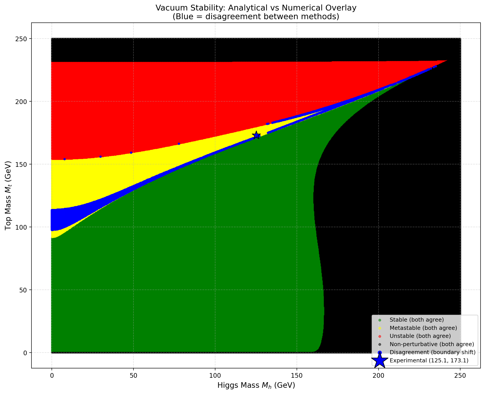
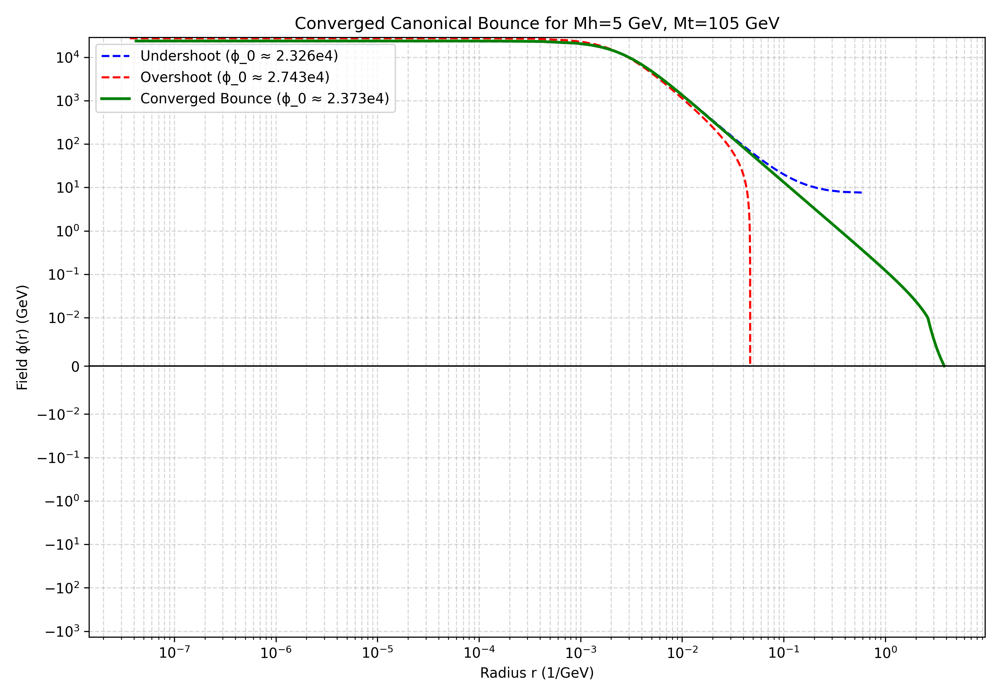

# SMVac

### Precision Computation of Electroweak Vacuum Stability in the Standard Model

SMVac is a computational framework for studying electroweak vacuum stability in the Standard Model. It combines precision renormalization group (RG) evolution with the semiclassical Fubini–Lipatov (conformal) ansatz to estimate the semiclassical vacuum decay action and the corresponding decay rate. Rather than assuming a constant quartic coupling, the code numerically integrates the RG-improved effective potential over the analytical conformal field profile.
---

## Highlights

- Implements 3-loop Standard Model RG evolution.
- Incorporates next-to-next-to-leading order (NNLO) electroweak matching at the top mass scale.
- Constructs the 1-loop Coleman–Weinberg effective potential.
- Evaluates the bounce action using an RG-improved Fubini–Lipatov ansatz.
- Optimizes the Fubini–Lipatov scale parameter using Golden Section Search.
- Leverages OpenMP parallelization for dense parameter space sweeps.

---

## Primary Result


*Phase diagram of the Standard Model vacuum across the Higgs–top mass plane, constructed using the RG-improved Fubini–Lipatov action.*

---

## Features

### Physics
- NNLO top-quark matching conditions.
- 3-loop beta functions for the gauge couplings ($g_1, g_2, g_3$), top Yukawa ($y_t$), and Higgs quartic ($\lambda$).
- Semiclassical decay rate estimation via the conformal Fubini–Lipatov approximation evaluated over the RG-improved potential.

### Software
- Standalone C++ routines for coupling evolution and potential integration.
- RK4 integration of the Renormalization Group Equations up to the Planck scale.
- Composite Simpson's rule for integrating the effective potential.
- Golden Section Search for optimizing the conformal bubble radius parameter.
- Python-based pipeline for parameter sweeps and Matplotlib visualization.

---

## Scientific Motivation

The measured values of the Higgs boson and top quark masses place the Standard Model near the boundary between absolute stability and metastability. Standard analytical treatments often rely on the strict Fubini–Lipatov ansatz, which assumes the effective potential is purely quartic ($\lambda \phi^4$) and dominated by a constant negative coupling at very high energy scales. 

However, near the metastability boundary,the full running of the couplings introduce significant corrections. This repository evaluates a more precise "RG-improved" action. It retains the analytical conformal field profile but numerically integrates the fully running, 1-loop effective potential over that profile. This approach captures the nontrivial shape of the potential while bypassing the computational complexity of solving the full, non-linear Euclidean bounce equation of motion.

---

## Architecture



---

## Repository Structure

- **`apps/`**: C++ numerical and analytical solvers (e.g., `solver_numerical.cpp`).
- **`scripts/`**: Python orchestration and visualization scripts (e.g., `run_numerical.py`).
- **`data/`**: Output directory for generated CSV datasets.
- **`figures/`**: Output directory for generated phase diagrams and plots.
- **`docs/`**: Documentation and verification planning files.

---

## Installation

A formal build system (e.g., CMake) is not currently implemented. The solvers must be compiled directly using a C++17 compatible compiler (like `g++`) with OpenMP enabled.

```bash
git clone https://github.com/namangoyal31/SMVac.git
cd SMVac

# Compile the numerical solver used by the Python sweep scripts
g++ -std=c++17 -O3 -fopenmp apps/solver_numerical.cpp -o apps/generate_phase_diagram.exe
```
*(Note: The Python wrapper scripts explicitly expect the executable to be named `apps/generate_phase_diagram.exe`.)*

### Quick smoke test
Before launching the full sweep, verify the binary directly on a 10-point chunk:
```bash
./apps/generate_phase_diagram.exe --numerical 0 10    # writes data/data_numerical_chunk_0.csv
./apps/generate_phase_diagram.exe --analytical 0 10   # writes results/analytical_data_chunk_0.csv
```
If either exits non-zero or produces no CSV, do not start the full sweep.

---

## Getting Started

Data generation is separated from visualization. To reproduce the phase diagram:

1. **Compile the solver** as shown in the Installation section.
2. **Run the parameter sweep** across the $(M_h, M_t)$ plane:
   ```bash
   python scripts/run_numerical.py
   ```
   *(This script distributes the workload across 12 processes. Generating the 1-million point grid will take several hours.)*
3. **Generate the phase diagram** from the CSV output:
   ```bash
   python scripts/plot_numerical_contours.py
   ```

---

## Validation

The numerical integration routines in this repository have been benchmarked against the strict analytical conformal limit $S_{\text{approx}} = 8\pi^2 / (3|\lambda_{\text{min}}|)$. 

Extracted from the repository's `data/numerical_data.csv` output:
- **Deep Metastability** ($M_h = 115.0, M_t = 180.0$): The RG-improved action deviates from the pure analytical approximation by only **-0.01%**, confirming that the conformal limit holds deep in the unstable regime.
- **Near the Phase Boundary** ($M_h = 134.75, M_t = 176.50$): The RG-improved action deviates by **32.1%**, illustrating significant deviations from the constant-coupling approximation near the metastability boundary.

---

## Results

### Analytical vs RG-Improved Disagreement

*This figure highlights the regions where the strict analytical approximation (conformal limit) misclassifies the vacuum state compared to the RG-improved calculation. The differences emerge primarily near the stability boundary where the running of the couplings cannot be ignored.*

### Optimization Convergence

*This diagnostic plot demonstrates the internal convergence behavior of the solver's minimization algorithms. (Note: specific diagnostic scripts under `src/` are used to generate these convergence traces).*

---

## Current Limitations

To maintain scientific transparency, the following limitations apply to the current implementation:
- **No exact bounce PDE solver:** The repository does *not* integrate the true spatial equation of motion ($\phi'' + \frac{3}{r}\phi' = \frac{dV}{d\phi}$). It evaluates the Fubini-Lipatov ansatz using numerical integration of the effective potential.
- **No adaptive RK4 for the bounce:** The RK4 solver is used strictly for the Renormalization Group Equations over the energy scale $\mu$, not the spatial coordinate $r$.
- **Hardcoded parameters:** Python wrapper scripts currently hardcode thread counts (`NUM_PROCESSES = 12`), chunk sizes, and grid resolutions.
- **No formal build system:** The project relies on manual `g++` compilation rather than Make or CMake.
- **Limited automated testing:** While a basic GitHub Actions CI is present to check compilation, rigorous numerical tolerance enforcement tests are not yet fully automated.

---

## Future Work

Planned improvements to the repository include:
- Investigation of full numerical bounce solutions through boundary-value methods (e.g., shooting or relaxation)
- Integration of a robust CMake build system.
- Addition of a formalized C++ testing framework (e.g., Catch2 or GoogleTest) to guarantee quadrature and integration tolerances.
- Command-line argument parsing for Python grid generation scripts.

---

## References

1. Fubini, S. (1976). A new approach to conformal invariant field theories. *Nuovo Cimento A*, 34(3), 521-554.
2. Lipatov, L. N. (1977). Divergence of the perturbation-theory series and the semiclassical theory. *Sov. Phys. JETP*, 45(2), 216-223.
3. Buttazzo, D., Degrassi, G., Giardino, P. P., Giudice, G. F., Sala, F., Salvio, A., & Strumia, A. (2013). Investigating the near-criticality of the Higgs boson. *Journal of High Energy Physics*, 2013(12), 89.
4. Andreassen, A., Frost, W., & Schwartz, M. D. (2018). Scale invariant instantons and the complete lifetime of the standard model. *Physical Review D*, 97(5), 056006.
5. Degrassi, G., Di Vita, S., Elias-Miro, J., Espinosa, J. R., Giudice, G. F., Isidori, G., & Strumia, A. (2012). Higgs mass and vacuum stability in the Standard Model at NNLO. *Journal of High Energy Physics*, 2012(8), 98.

---

## Citation

If you use SMVac in your research, please cite the repository using the provided `CITATION.cff` or as follows:

```bibtex
@misc{smvac2026,
  author = {Naman Goyal},
  title = {SMVac: Precision Computation of Electroweak Vacuum Stability in the Standard Model},
  year = {2026},
  publisher = {GitHub},
  journal = {GitHub repository},
  howpublished = {\url{https://github.com/namangoyal31/SMVac}},
  doi = {[TODO: DOI]}
}
```
