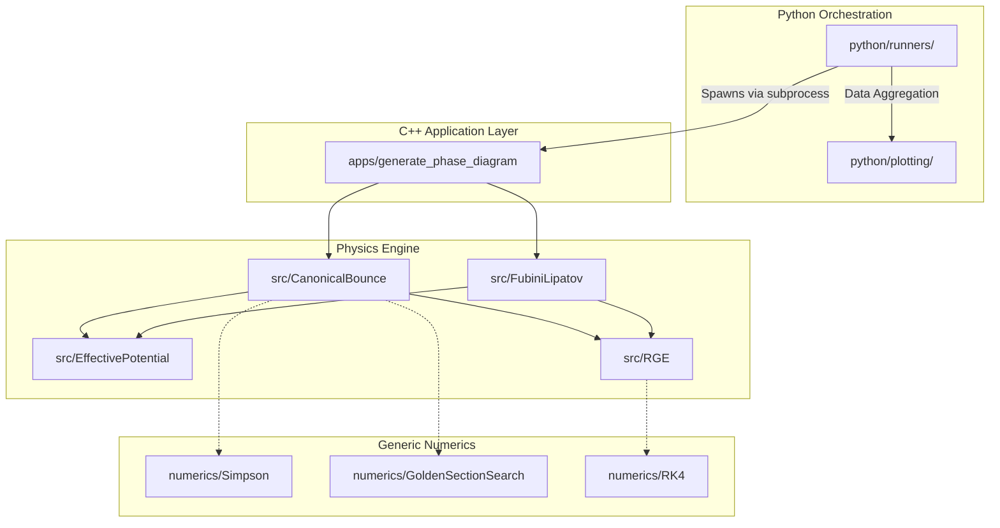

# SMVacuumDecay

This repository provides a modular C++ framework for studying electroweak vacuum stability in the Standard Model through multi-loop renormalization group evolution, effective potential calculations, and semiclassical vacuum decay.

## Features

- **Full 3-Loop RGE Integration:** Integrates Standard Model parameters with NNLO boundary matching conditions via an adaptive 4th-order Runge-Kutta solver.
- **Effective Potential Evaluation:** 1-loop effective potential corrections for vacuum decay.
- **Fubini-Lipatov Analytical Solver:** Fast conformal approximation of the bounce action $S \approx 8\pi^2 / 3|\lambda_{eff}|$.
- **Canonical Bounce Numerical Solver:** Exact evaluation of the Euclidean action using 2048-point Simpson integration and Golden Section Search minimization.
- **Generic Numerics Backend:** Standalone numerical components for ODE integration, 1D optimization, and numerical integration.

## Architecture



## Project Layout

- `include/SMVacuumDecay`: Header files exposing the core API and generic numerics.
- `src/`: Implementation of the physics modules (`RGE`, `EffectivePotential`, `CanonicalBounce`, `FubiniLipatov`).
- `apps/`: Command-line tools (e.g. `generate_phase_diagram.exe`, `benchmark_scan.exe`).
- `tests/`: Scientific validation suites ensuring floating point results perfectly match legacy literature and benchmark runs.

## Building and Running

(CMake build support pending)
For manual compilation with Mingw-w64:

```bash
g++ -std=c++17 -O3 -I SMVacuumDecay/include \
  SMVacuumDecay/src/RGE.cpp \
  SMVacuumDecay/src/EffectivePotential.cpp \
  SMVacuumDecay/src/CanonicalBounce.cpp \
  SMVacuumDecay/src/FubiniLipatov.cpp \
  SMVacuumDecay/apps/benchmark_scan.cpp \
  -o benchmark_scan.exe

./benchmark_scan.exe 125.1 173.1
```

## Legacy and Provenance
The exact provenance of this code from the original research codebase (`Threshold/`) is documented in `CODE_PROVENANCE.md`.

## Citation
If you use this library in your research, please cite the corresponding paper. See `CITATION.cff` for details.
